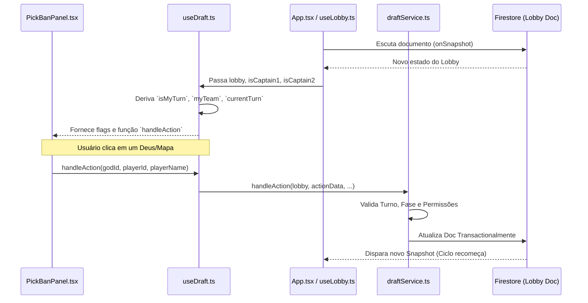

# Mythos Draft — AI Project Context

> **Para IAs:** Este documento é a fonte da verdade sobre o projeto. Leia-o inteiro antes de qualquer implementação. Ele contém armadilhas conhecidas, padrões obrigatórios e decisões de arquitetura críticas.

---

## 1. O QUE É O PROJETO

**Mythos Draft** é uma plataforma web de draft competitivo para Age of Mythology: Retold (AoM). Usuários criam lobbies, se autenticam e fazem o draft de deuses e mapas em tempo real via Firestore.

**Forja de Hefesto** é um sub-módulo dentro do mesmo repositório — um hub para um torneio brasileiro semanal recorrente. Ela tem sistema de inscrições, perfis de jogadores, draft de times, tabelas de grupo e integração com dados do aomstats.io.

---

## 2. STACK TECNOLÓGICA

| Camada | Tecnologia |
|---|---|
| Frontend | React 19 + TypeScript + Vite 6 |
| Estilo | TailwindCSS 4 (`@tailwindcss/vite`) + CSS próprio |
| Banco de dados | Firebase Firestore (banco nomeado: `mythosdraft-prod`) |
| Auth | Firebase Auth (anônimo para o Draft; Discord OAuth2 para a Forja) |
| Backend | Firebase Cloud Functions v2 (Node.js, arquivo: `functions/index.js`) |
| Deploy | Firebase Hosting + Express server (`server.ts`) |
| Animações | Motion (Framer Motion v12) |
| Drag & Drop | @hello-pangea/dnd |

---

## 3. ESTRUTURA DE DIRETÓRIOS

```
mythos-draft-2/
├── src/
│   ├── App.tsx              # Roteamento principal + toda a lógica do Draft principal
│   ├── types.ts             # Tipos do DRAFT (Lobby, God, Map, DraftTurn…)
│   ├── constants.ts         # Re-exporta tudo de src/data/
│   ├── firebase.ts          # Inicialização Firebase + handleFirestoreError()
│   ├── data/                # gods.ts, maps.ts, draft.ts, translations.ts
│   ├── services/
│   │   ├── lobbyService.ts  # CRUD de lobbies no Firestore (~58KB, arquivo maior)
│   │   ├── draftService.ts  # Lógica de estado do draft (~28KB)
│   │   ├── discordService.ts# Webhook do Discord
│   │   └── soundService.ts  # Áudio
│   ├── hooks/               # Custom hooks React
│   ├── components/          # Componentes do Draft principal
│   └── features/
│       └── forja/           # MÓDULO FORJA (isolado)
│           ├── types.ts     # Tipos da Forja (ForjaPlayer, ForjaTeam…)
│           ├── ForjaHub.tsx # Shell da Forja (tabs, auth Discord)
│           ├── forja.css    # CSS exclusivo da Forja (~63KB)
│           ├── forjaUtils.ts# Helpers (effectiveElo, tier, etc.)
│           ├── services/forjaService.ts  # CRUD Firestore da Forja (~31KB)
│           ├── views/       # Páginas da Forja:
│           │   ├── ForjaHome.tsx      # Hub principal (fase, tabela compacta, premiação)
│           │   ├── ForjaInicio.tsx    # Lista de inscritos (aba 'Inscritos')
│           │   ├── ForjaTabela.tsx    # Classificação + partidas
│           │   ├── ForjaFormato.tsx   # Snake Draft visualizer (16 capitães)
│           │   ├── ForjaCustomDraft.tsx # Draft Rápido (visível p/ logados)
│           │   └── ...               # Regras, Mapas, Schedule, Times, OBS…
│           └── components/  # Modais da Forja (AdminPlayerModal, etc.)
├── functions/
│   └── index.js             # Cloud Functions (updateEloSnapshot, fetchaomprofile)
├── firestore.rules          # Regras de segurança do Firestore
├── security_spec.md         # Especificação de segurança (Dirty Dozen)
├── firebase-applet-config.json # Config do Firebase (NÃO commitada com secrets)
└── .env                     # Variáveis de ambiente (VITE_VIBE_MODE, etc.)
```

---

## 4. AUTENTICAÇÃO

### Draft Principal
- Usa **Firebase Auth Anônimo** (`signInAnonymously`).
- O `uid` anônimo identifica o capitão no lobby.
- `captain1`, `captain2`, `adminId` no documento do lobby armazenam UIDs.

### Forja de Hefesto
- Usa **Discord OAuth2** implementado **client-side** via popup.
- O fluxo redireciona para `https://discord.com/oauth2/authorize`.
- O resultado é guardado em `localStorage` como `forja_discord_user` (JSON).
- **Estrutura do objeto:**
  ```ts
  ForjaDiscordUser {
    discord_id: string;   // ID numérico do Discord
    username: string;
    discriminator: string;
    avatar_url: string;   // URL do CDN do Discord
    access_token?: string;
  }
  ```
- A verificação de admin é feita **no Firestore**: `forja_players/{discord_id}.role === 'admin'`.
- **⚠️ LIMITAÇÃO DE SEGURANÇA CONHECIDA:** A auth Discord é client-side e não usa Firebase Auth real. Portanto, o `request.auth.uid` nas regras do Firestore é o UID anônimo, não o `discord_id`. As regras de `forja_players` usam `playerId` (que é o `discord_id`), mas o sistema confia na integridade do cliente para não alterar campos protegidos.

---

## 5. COLEÇÕES DO FIRESTORE

### Banco: `mythosdraft-prod`

| Coleção | Descrição | Chave do documento |
|---|---|---|
| `lobbies` | Sessões de draft | ID aleatório (gerado pelo app) |
| `lobbies/{id}/messages` | Chat do lobby | ID aleatório |
| `metadata` | Índice de lobbies ativos | `lobbyIndex` |
| `presets` | Presets de draft | ID do preset |
| `test/connection` | Ping de conectividade | fixo |
| `forja_players` | Jogadores inscritos na Forja | `discord_id` |
| `forja_teams` | Times formados no draft da Forja | ID do time |
| `forja_content` | CMS (regras, formato, premiação) | `rules`, `format`, `prize`, `tournament` |
| `forja_schedule` | Agenda de partidas | ID aleatório |
| `forja_meta` | Sessão de draft da Forja | `draft` |
| `forja_status` | Status de operações longas | `snapshot` |
| `forja_bans` | Lista de banimentos | `discord_id` |

---

## 6. CLOUD FUNCTIONS (`functions/index.js`)

### `updateEloSnapshot` (onCall)
- Chamada por Admin via UI.
- Itera todos `forja_players` com `aom_profile_id` ou `aom_id`.
- Busca stats em `form-retold.vercel.app` (scraper intermediário).
- Atualiza: `elo_1v1`, `elo_tg`, `elo_efetivo`, `elo_snapshot`, e condicionalmente `avatar_url` e `top_gods`.
- Usa merge (`set(..., { merge: true })`) para não apagar campos existentes.
- Escreve progresso em `forja_status/snapshot`.

### `fetchaomprofile` (onRequest — HTTP GET)
- **Nome da function é `fetchaomprofile` em letras MINÚSCULAS.**
- **⚠️ ARMADILHA CRÍTICA:** O nome da export no código é `fetchaomprofile` (lowercase). A URL do endpoint gerada pelo Firebase segue esse nome exatamente. Qualquer chamada a `FetchAomProfile` ou variações camelCase vai retornar 404. **Sempre verifique o nome exato no `functions/index.js`.**
- URL do endpoint: `https://us-central1-[PROJECT_ID].cloudfunctions.net/fetchaomprofile`
- Parâmetro: `?id=<aom_profile_id>`
- CORS liberado para: `https://mythosdraft.com`, `http://localhost:5173`, `http://localhost:3000`

---

## 7. TIPOS CRÍTICOS

### `ForjaPlayer` (src/features/forja/types.ts)
- `discord_id`: chave primária — é o ID do Discord e o document ID no Firestore.
- `aom_profile_id`: ID numérico do aomstats.io (número inteiro).
- `aom_id`: slug/alias para URLs do aomstats.
- `elo_efetivo`: calculado como `Math.round((elo_1v1 + elo_tg) / 2)`.
- `esports_elo_enabled` + `esports_elo_value`: quando `enabled === true`, o ELO efetivo exibido é `esports_elo_value` (usado para ex-profissionais).
- `top_gods_admin`: array de god IDs definido pelo Admin, sobrepõe o `top_gods` scrapeado.
- `status`: `'available' | 'drafted' | 'reserve' | 'rejected' | 'pending' | 'banned'`
- `role`: `'player' | 'admin'` — **nunca deixe o cliente escrever este campo sem validação server-side.**

### `Lobby` (src/types.ts)
- `adminId`: UID do criador do lobby (Firebase Auth anônimo).
- `config.forjaMatchId`, `config.forjaTeamA`, `config.forjaTeamB`: integração com a Forja.
- `timerStart`, `createdAt`, `lastActivityAt`: sempre use `serverTimestamp()` do Firestore, nunca `new Date()` do cliente.

---

## 8. PADRÕES DE CÓDIGO OBRIGATÓRIOS

### 8.1 Timestamps
```ts
// ✅ CORRETO
import { serverTimestamp } from 'firebase/firestore';
await updateDoc(ref, { lastActivityAt: serverTimestamp() });

// ❌ ERRADO — corrompe a ordenação no Firestore
await updateDoc(ref, { lastActivityAt: new Date() });
await updateDoc(ref, { lastActivityAt: Date.now() });
```

### 8.2 Merge em updates da Forja
```ts
// ✅ CORRETO — não apaga campos existentes
await setDoc(playerRef, updateData, { merge: true });

// ❌ ERRADO — pode zerar campos como esports_elo_enabled, top_gods_admin
await setDoc(playerRef, updateData);
```

### 8.3 Leitura de forja_players
```ts
// ✅ CORRETO — use snapshot listener para updates em tempo real
onSnapshot(collection(db, 'forja_players'), (snap) => {
  const players = snap.docs.map(d => ({ ...d.data(), discord_id: d.id } as ForjaPlayer));
});

// Ou para leitura única:
const snap = await getDocs(collection(db, 'forja_players'));
```

### 8.4 effectiveElo (forjaUtils.ts)
```ts
// Sempre use getEffectiveElo() de forjaUtils.ts — nunca recalcule inline
import { getEffectiveElo } from '../forjaUtils';
const elo = getEffectiveElo(player); // respeita esports_elo_enabled
```

### 8.5 Verificação de Admin
```ts
// No frontend (Forja):
const isAdmin = discordUser?.discord_id && player?.role === 'admin';

// No Firestore Rules:
function isAdmin() {
  return isSignedIn()
    && exists(/databases/$(database)/documents/forja_players/$(request.auth.uid))
    && get(...).data.role == 'admin';
}
// ⚠️ NOTA: como auth é anônima, request.auth.uid ≠ discord_id. As regras de admin
// via Firestore funcionam se o UID anônimo for também o document ID (não é o caso atual).
// Por isso, algumas operações admin são feitas via Cloud Functions com admin SDK.
```

### 8.6 Arquitetura de Leituras (Cold Fetch vs Real-Time)
**NUNCA utilize `onSnapshot` por padrão para dados CMS ou estáticos** (Regras, Map Pool, Settings, Cronograma). O uso indiscriminado de tempo real causa picos massivos de custo (Zombie Listeners / Multiplicação de Reads em navegação).
- **Dados CMS / Estáticos:** Utilize **Busca Fria (`get...Once()`) atrelada a Cache em Memória (Singleton)** no módulo de serviço (`forjaService.ts`).
- **Mutação de Cache:** Operações de escrita pelo Admin devem mutar o Cache local IMEDIATAMENTE após sucesso no Firestore, para atualização seamless sem F5.
- **Eventos Ao Vivo (Draft):** Para dados como `forja_teams`, utilize `useForjaTeams(true)` (flag `isLive`) apenas nas views de Draft/Admin para habilitar o Web Socket, mantendo as demais rotas públicas com fetch frio.

---

## 9. BUGS CONHECIDOS E ARMADILHAS

### 9.1 ⚠️ CASE-SENSITIVITY NA CLOUD FUNCTION
**O bug mais recente (maio/2026):** A Cloud Function exportada como `exports.fetchaomprofile` (tudo minúsculo) gerava URL `fetchaomprofile`. Chamadas de código usando `FetchAomProfile` ou `fetchAomProfile` falhavam com 404 silencioso.
**Regra:** Sempre confirme o nome exato da export em `functions/index.js` antes de chamar via HTTP.

### 9.2 ⚠️ Timestamp Serialization
Ao sanitizar dados de lobby para Firestore, nunca converta `Timestamp` do Firestore para `number` ou `string`. Isso quebra a ordenação e gera lobbies fora de ordem.

### 9.3 ⚠️ PWA / Service Worker conflitando com Firestore
O Vite PWA pode interceptar requests do Firestore offline e devolver dados stale. Se o Firestore parar de receber updates, verificar se o SW não está bloqueando a rota.

### 9.4 ⚠️ Lobby só aparece na lista pública quando ambos capitães entraram
`captain1Name` e `captain2Name` devem estar preenchidos. O índice de lobbies só lista sessões com os dois presentes.

### 9.5 ⚠️ Atualização condicional de avatar_url
Na Cloud Function, `avatar_url` só é atualizado se a API retornar um valor não-nulo. Isso preserva avatars do Discord configurados manualmente pelo Admin.

---

## 10. SEGURANÇA — ESTADO ATUAL E GAPS

### O que está protegido (Firestore Rules)
- Lobbies: apenas participantes (captain1, captain2, adminId) podem atualizar.
- Lobbies finalizados (`status === 'finished'`) não podem ser atualizados.
- `forja_teams`, `forja_content`, `forja_schedule`, `forja_meta`, `forja_status`, `forja_bans`: apenas admin pode escrever.
- `forja_players`: admin pode tudo; jogador só pode alterar `profile_link`, `availability`, `catchphrase`.

### Gaps de Segurança Conhecidos (PRIORIDADE ALTA)
1. **Autenticação da Forja é client-side:** O `discord_id` não é verificado server-side. Um atacante pode criar um documento `forja_players` com o `discord_id` de outra pessoa.
2. **`role: 'admin'` pode ser injetado na criação:** A regra `allow create: if isSignedIn()` não valida que `role !== 'admin'`. Qualquer usuário autenticado pode criar um documento com `role: 'admin'` se ainda não existir.
3. **API Key hardcoded em `functions/index.js`:** A `API_KEY = 'mythosdraftweb_8b73...'` está no código-fonte. Deveria estar em `process.env` / Firebase Secrets.
4. **`metadata` write aberto a qualquer autenticado:** Qualquer usuário pode corromper o índice de lobbies.
5. **`presets` create aberto a qualquer autenticado:** Deveria ser restrito a admins.

### Recomendações imediatas
```
// firestore.rules — adicionar no create de forja_players:
allow create: if isSignedIn()
              && !exists(...)
              && !('role' in request.resource.data)  // ← ADICIONAR ISSO
              && request.resource.data.get('role', 'player') == 'player';
```

---

## 11. VARIÁVEIS DE AMBIENTE

```env
# .env
VITE_VIBE_MODE=DEVELOPMENT   # ou 'PRODUCTION'
VITE_DISCORD_CLIENT_ID=...   # Client ID do app Discord
```

```json
// firebase-applet-config.json
{
  "apiKey": "...",
  "authDomain": "...",
  "projectId": "...",
  "storageBucket": "...",
  "messagingSenderId": "...",
  "appId": "...",
  "firestoreDatabaseId": "mythosdraft-prod"
}
```

---

## 12. FLUXO DA FORJA DE HEFESTO (Torneio Semanal)

```
Sábado:
  13:59 BRT → Inscrições fecham (registration_deadline_ms)
  14:00 BRT → Snapshot de ELO (Admin dispara updateEloSnapshot)
  14:00 BRT → Admin define seeds por ELO efetivo
  15:00 BRT → Draft de times começa (ForjaAdminDraft.tsx)
    └── Times escolhem jogadores em ordem snake
    └── Resultado salvo em forja_teams + forja_meta
  Após draft → Partidas acontecem, resultados em forja_schedule
```

### Draft de Times (ForjaDraftSession)
- Rounds: `B` (cobra invertida) e `C` (ordem direta).
- `pick_order_sequence`: array de `team_id` definindo a ordem snake.
- `current_pick_index`: posição atual no sequence.
- Capitães interagem via `ForjaDraftRoom.tsx` (viewers) e `ForjaAdminDraft.tsx` (controle).

---

## 13. INTEGRAÇÃO AOM.GG / AOMSTATS

- **API intermediária:** `form-retold.vercel.app` (scraper Node.js, não é nossa)
- **Endpoints usados:**
  - `GET /api/stats-by-id/{profileId}` → stats por ID numérico
  - `GET /api/stats/{nick}` → stats por nickname (fallback se 404)
  - `GET /api/gods/{profileId}` → top deuses
- **Autenticação:** Header `X-API-Key` + `Origin: https://mythosdraft.com`
- **Rate limiting:** 200ms entre requests na função de snapshot, retry 3x em 429.

---

## 14. COMANDOS ÚTEIS

```powershell
# Rodar em dev
npm run dev

# Build de produção
npm run build

# Verificar tipos TypeScript
npm run lint

# Deploy Cloud Functions
cd functions && firebase deploy --only functions

# Deploy Firestore Rules
firebase deploy --only firestore:rules

# Deploy completo
firebase deploy
```

---

## 15. CHECKLIST PRE-IMPLEMENTAÇÃO (para IAs)

Antes de implementar qualquer coisa, confirme:
- [ ] Estou usando `serverTimestamp()` e não `new Date()`?
- [ ] Estou usando `setDoc(..., { merge: true })` em updates de forja_players?
- [ ] O nome da Cloud Function que estou chamando bate exatamente com a export em `functions/index.js`?
- [ ] Campos protegidos (`role`, `esports_elo_enabled`, `esports_elo_value`, `top_gods_admin`, `seed`, `status`, `team_id`) estão sendo editados apenas via admin?
- [ ] Estou usando `getEffectiveElo()` de `forjaUtils.ts` para calcular ELO exibido?
- [ ] Timestamps do Firestore não estão sendo serializados para JSON sem tratamento especial?
- [ ] Novo campo adicionado a `ForjaPlayer` ou `Lobby` está nas Firestore Rules se necessário?

---

## 16. ESTADO ATUAL DO TORNEIO — DECISÕES RECENTES (Maio 2026)

### 16.1 Torneio tem 16 capitães (não 12)
O torneio Forja de Hefesto opera com **16 capitães (Tier A)**, totalizando 48 jogadores (16 × 3).
O visualizador em `ForjaFormato.tsx` foi atualizado para refletir isso. Qualquer novo visualizador deve usar 16.

### 16.2 Estrutura de Abas do ForjaHub

| Tab ID | Label | Visibilidade |
|---|---|---|
| `inicio` | Início | Pública — renderiza `ForjaHome.tsx` (hub) |
| `inscritos` | Inscritos | Pública — renderiza `ForjaInicio.tsx` (lista + inscrição) |
| `regras` | Regras | Pública |
| `mapas` | Mapas | Pública |
| `formato` | Formato | Pública |
| `schedule` | Schedule | Pública |
| `times` | Times | Pública |
| `tabela` | Tabela | Pública |
| `custom-draft` | Draft Rápido | Usuário Discord logado (`discordUser != null`) |
| `admin-draft` | Draft Admin | Admin only |
| `obs` | OBS Mode | Admin only |

### 16.3 ForjaHome (nova aba Início)
`src/features/forja/views/ForjaHome.tsx` — Hub visual do torneio:
- Status de inscrição compacto (usuário logado)
- Cards: fase atual, contagem de times, premiação via CMS
- Próximas partidas (lobbies FORJA não finalizados, max 3)
- Tabela de grupos compacta com **popover de membros** ao hover (desktop + tap mobile)
- Botões de navegação para outras abas (`onTabChange`)
- A aba `inscritos` (`ForjaInicio.tsx`) mantém toda a UI de hero de inscrição e listagem de jogadores

### 16.4 ForjaSettings — Campos Adicionados
```ts
interface ForjaSettings {
  // ... campos existentes ...
  current_phase?: 'pre_tournament' | 'group_stage' | 'playoffs' | 'finished';
  playoff_format?: 'single_elim' | 'double_elim'; // 'double_elim' em breve (disabled)
}
```
Configurável via `ForjaTournamentSettingsModal` (aba Inscritos → botão ⚙️ Configurações).

### 16.5 Reset do Game 3 no Preset FORJA
**Bug corrigido (Maio 2026):** `resetCurrentGame` em `lobbyService.ts` zerava o `seriesMaps[2]` para lobbies FORJA porque não havia lógica equivalente à do MCL.

**Regra fixada (dois caminhos: DEV e Firestore):**
- **FORJA Game 3:** mapa foi **sorteado aleatoriamente** — deve ser **preservado** (`restoredMap = data.seriesMaps[2]`).
- **MCL Game 3:** mapa é **pré-determinado pelo round** (`MCL_ROUND_MAPS[mclRound]`) — deve ser **restaurado**.
- **G1 e G2 (qualquer preset):** slot limpo para novo pick de mapa.

### 16.6 LobbyConfig — Flags da Forja
```ts
interface LobbyConfig {
  // Flags específicas da Forja:
  hasMap3RandomRoll?: boolean;  // G3 tem mapa sorteado aleatoriamente
  hasPerMapBans?: boolean;      // 1 ban de deus por mapa antes dos picks (Playoffs)
}
```

### 16.7 Draft Rápido (ForjaCustomDraft)
- Cria lobbies pré-configurados com regras MCL injetadas automaticamente.
- Visível para **qualquer usuário Discord logado** (não apenas admins).
- Inicializa os picks com esqueleto 3v3 via `getMCLPicks()` para o DraftUI renderizar.

### 16.8 useDraft — startsWithB para FORJA
O hook `useDraft.ts` tem uma condição `startsWithB` que determina que, no Game 3, o perdedor do Game 2 escolhe o mapa primeiro. Essa condição foi expandida para incluir o preset `FORJA` além do `MCL`.

---

## 17. ARQUITETURA DE ESTADO DO DRAFT (Fluxograma)

A hierarquia de estado no React e a interação com o Firestore seguem um fluxo estrito para garantir sincronia em tempo real e prevenção de concorrência.



**Conceitos Críticos da Arquitetura:**
1. **Unidirectional Data Flow:** O componente visual (`PickBanPanel`, `DraftBoard`) **NUNCA** muta estado local permanente. Tudo é delegado para o `handleAction` no `useDraft.ts`, que chama `draftService.ts`.
2. **Derivação de Identidade (`myTeam` e `isMyTurn`):** A identidade não é baseada apenas no Auth Anônimo, mas num wrapper (`isCaptain1` e `isCaptain2`) que no caso da Forja é **sobreposto pela checagem do Discord Team ID**.

---

## 18. LIFECYCLE DE LOBBIES E ELENCOS (O "Ghost Roster Bug")

A inicialização dos elencos (`teamAPlayers` e `teamBPlayers`) difere brutalmente dependendo do contexto da partida. É crucial entender isso para evitar que a UI de seleção trave.

### Cenário 1: Partida Padrão (MCL ou Casual)
1. Link do lobby é acessado.
2. `App.tsx` detecta que o usuário não é `captain1` nem `captain2`.
3. Modal `JoinLobbyModal.tsx` é forçado na tela.
4. Usuário preenche os nomes de sua equipe.
5. `JoinLobbyModal` chama `lobbyService.joinLobby`, que **popula `teamAPlayers` ou `teamBPlayers`**.
6. Draft prossegue normalmente.

### Cenário 2: Partidas Oficiais da Forja (Aba Tabela)
1. Admin clica em "Criar Partida". O lobby é gerado no Firestore com `teamAPlayers: []` e `teamBPlayers: []`.
2. Como a funcionalidade foi corrigida, **`ForjaTabela.tsx` injeta os jogadores no ato da criação** utilizando o cache do Firebase (`forjaPlayers`).
3. Quando os capitães entram na sala, o `App.tsx` reconhece seus `discord_id` via `forjaTeamA/B` e lhes concede `isCaptain1/2` igual a `true`.
4. O `JoinLobbyModal` é **bypassado inteiramente**.
5. O draft prossegue usando os elencos pré-populados.

### Cenário 3: Draft Rápido da Forja (Testes / Solo Join)
1. Semelhante à Partida Oficial, mas `isOfficialForjaMatch` é FALSO.
2. Ao utilizar a opção "Solo Join (Dev)" para testes, o `JoinLobbyModal` é bypassado **sem** preencher as listas de elenco.
3. Isso causa um estado vazio nas arrays.
4. **O Sistema de Fallback:** Para evitar a quebra completa da UI (`PickBanPanel.tsx` parando de exibir botões), foi implementado um **fallback estático**. Se `teamAPlayers/teamBPlayers` estiver vazio em presets `MCL/FORJA`, o painel gera objetos genéricos (`Player 1`, `Player 2`, etc.) instantaneamente para destravar a interação.

## 19. ARQUITETURA DO MOTOR DE DRAFT E FLUXO DE TORNEIO

### Cenário 1: Separação Estrita de Domínio (Decoupling)
1. **O Motor Matemático (Timeline) vs O Motor Visual (CSS):** Nunca embaralhe arrays de jogadores no banco de dados para forçar uma posição visual na tela. 
2. A injeção da `lineup` nos slots de draft DEVE ser sempre linear baseada na ordem cronológica de turnos.
3. Se o "Último Pick" (P3) precisa aparecer no meio da tela (Pocket), isso deve ser resolvido **exclusivamente via CSS** (ex: usando `order-2` no Flexbox), mantendo os dados da array intactos.

### Cenário 2: A Regra das "Cadeiras" (Imutabilidade de Slots)
1. O sistema utiliza um conceito de "Pool Dinâmico". O Roster lateral é apenas informativo e estático.
2. Os Turnos de Pick (`picks`) são "cadeiras vazias" com IDs cronológicos fixos (ex: `playerId: 4`).
3. Ao registrar a escolha de um deus, o estado DEVE atualizar apenas as propriedades dinâmicas (`playerName`, `godId`).
4. **Mutação Proibida:** É estritamente proibido sobrescrever ou clonar o `playerId` (Slot ID) de um turno. A "cadeira 4" sempre será a cadeira 4, independente de qual jogador sente nela.

### Cenário 3: Adaptação Dinâmica de Timeline (Snake Draft G1 vs G2)
1. A ordem em que os slots são chamados muda conforme o jogo (`gameNumber`), mas o ID fixo do slot no mapa não muda.
2. **G1 (Host Starts):** O motor consome a timeline `[1, 2, 3, 4, 5, 6]`. (Host no slot 1 escolhe primeiro).
3. **G2 (Guest Starts):** O motor consome a timeline `[3, 4, 1, 2, 6, 5]`. (Guest no slot 3 escolhe primeiro).
4. O CSS do Mapa (`MapVisualizer`) inverte visualmente as coordenadas (Laranja/Vermelho e Azul/Rosa) mantendo a integridade matemática da engine.

### Cenário 4: Fluxo Seguro de Reset e Preservação de Mapa (Game 3)
1. **Bloqueio de Auto-Start:** Qualquer ação de "Reset Current Game" DEVE obrigatoriamente forçar `ready1: false` e `ready2: false`, retornando o lobby para o status de espera. O draft nunca inicia sem a confirmação de ambos.
2. **Imutabilidade do G3 (Random Map):** No preset FORJA, o Game 3 utiliza um mapa aleatório. Em caso de Reset, a função limpa os Picks e os Bans, mas o `mapId` original sorteado é salvo e **mantido**, evitando exploits de re-sorteio de mapa.
